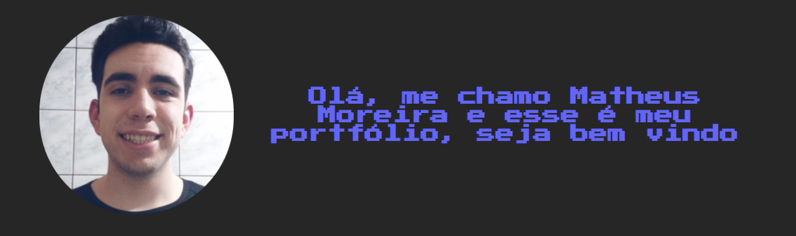

    💻<h1>Meu portfólio </h1>

    
    <a href="https://portfolio-moreiramatheus.vercel.app">Clique aqui para visitar meu portfolio na web</a>

>⚠️ **Aviso!** ⚠️
>
> No momento o projeto não se encontra disponivel na web pois está em manutenção

## Sobre mim 😄
Sou estudante e programador em busca de uma oportunidade nesse ramo que tanto gosto.

Atualmente estou cursando Análise e desenvolvimento de sistemas e busco sempre aprimorar meus conhecimentos em tecnologias como HTML, CSS e JavaScript.

Tenho como meta de me tornar um desenvolvedor mobile e criar apps que sejam uteis no dia a dia das pessoas.

## O que estudo 📕
* Python
* TypeScript
* JavaScript
* HTML5
* CSS3
* React.JS
* Styled-components
* Git

>⚠️ **Aviso!** ⚠️
>
> projeto em constante desenvolvimento, futuramente irei atualizar esse projeto confrome meus conhecimentos forem ficando mais aprimorados, caso queira, fique a vontade para acompanhar meu desenvolvimento.
